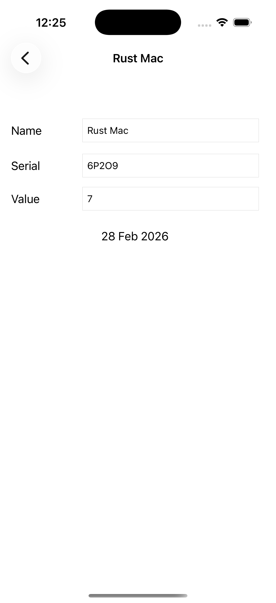
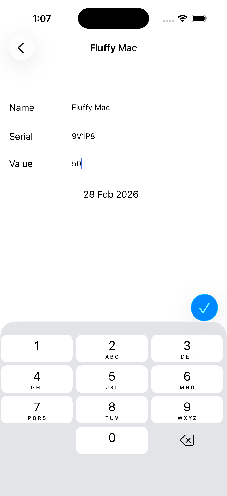
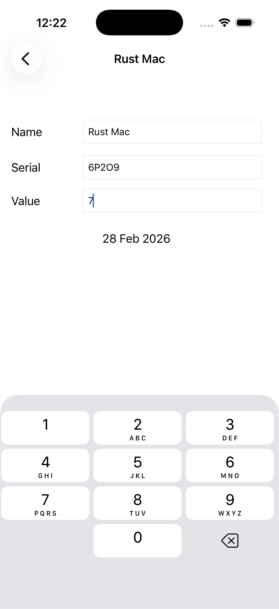

## Exercise
> In this chapter, you will use a UINavigationController to add a drill-down interface to Homepwner
that lets the user view and edit the details of a BNRItem

## Challenges

### 🥇 Gold Challenge: Pushing More View Controllers
> Right now, instances of BNRItem cannot have their dateCreated property changed. Change BNRItem
so that they can, and then add a button underneath the dateLabel in BNRDetailViewController
with the title Change Date. When this button is tapped, push another view controller instance onto
the navigation stack. This view controller should have a UIDatePicker instance that modifies the
dateCreated property of the selected BNRItem.

### 🥈 Silver Challenge: Dismissing a Number Pad
> After completing the bronze challenge, you may notice that there is no return key on the number pad.
Devise a way for the user to dismiss the number pad from the screen.

### 🥉 Bronze Challenge: Displaying a Number Pad

> The keyboard for the UITextField that displays a BNRItem’s valueInDollars is a QWERTY
keyboard. It would be better if it was a number pad. Change the Keyboard Type of that UITextField to
the Number Pad. (Hint: you can do this in the XIB file using the attributes inspector.) 

