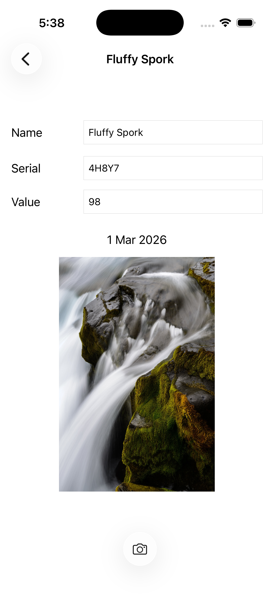
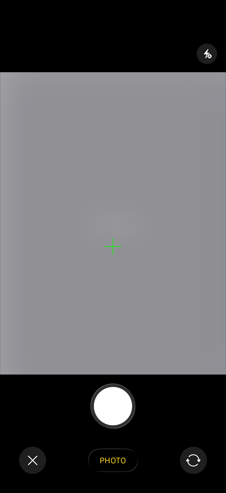
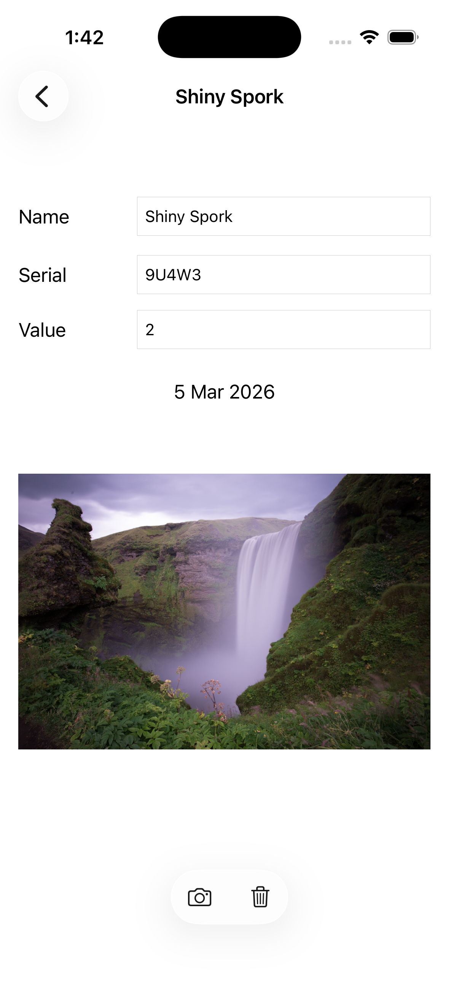
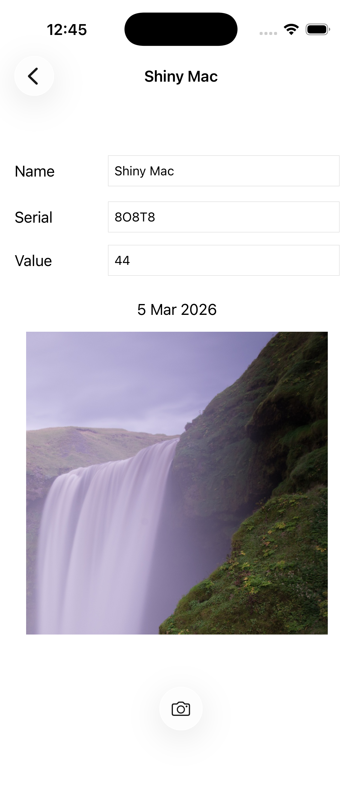

## Exercise
> In this chapter, you are going to add photos to the Homepwner application

## Challenges

### 🥇 Gold Challenge: Camera Overlay
> A UIImagePickerController has a cameraOverlayView property. Make it so that presenting the
UIImagePickerController shows a crosshair in the middle of the image capture area.

### 🥈 Silver Challenge: Removing an Image
> Add a button that clears the image for an item. 

### 🥉 Bronze Challenge: Editing an Image

>  UIImagePickerController has a built-in interface for editing an image once it has been selected.
Allow the user to edit the image and use the edited image instead of the original image in
BNRDetailViewController.

