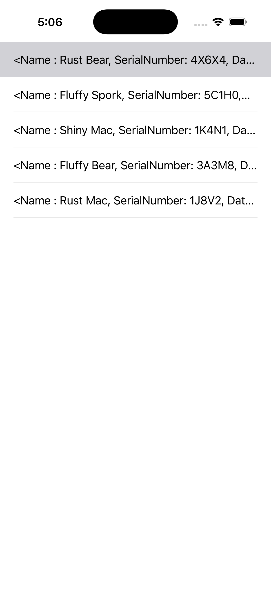
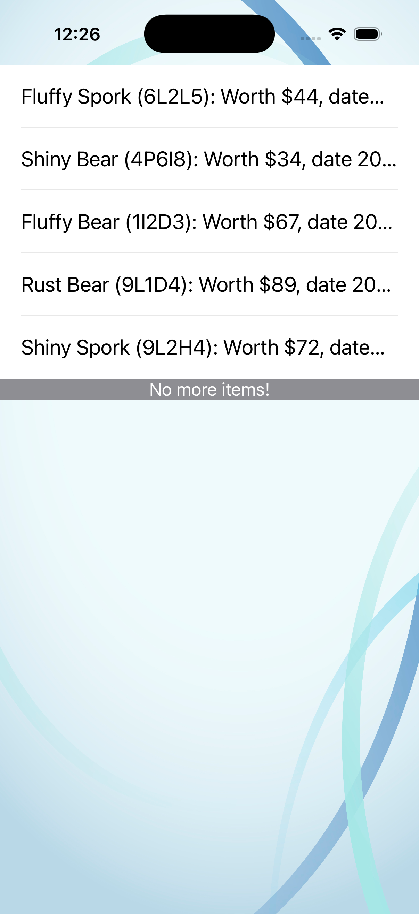
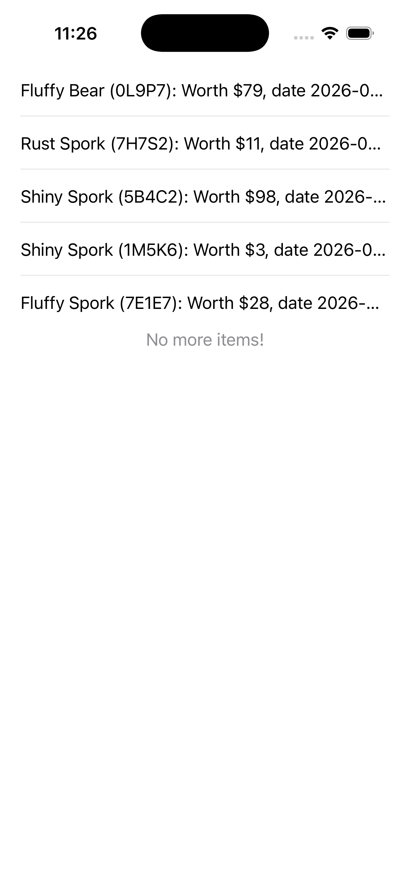

## Exercise
> Homepwner will present a list
of BNRItem objects in a UITableView

## Challenges

### 🥇 Gold Challenge:
> Make each row’s height 60 points except for the last row from the silver challenge, which should
remain 44 points. Then, change the font size of every row except the last to 20 points. Finally, make the
background of the UITableView display an image. (To make this pixel-perfect, you will need an image
of the correct size depending on your device. Refer to the chart in Chapter 1.)

### 🥈 Silver Challenge: Constant Rows
> Make it so the last row of the UITableView always has the text No more items!. Make sure this row
appears regardless of the number of items in the store (including 0 items).

### 🥉 Bronze Challenge: Sections
> Have the UITableView display two sections – one for items worth more than $50 and one for the rest.
Before you start this challenge, copy the folder containing the project and all of its source files in
Finder. Then tackle the challenge in the copied project; you will need the original to build on in the
coming chapters.

